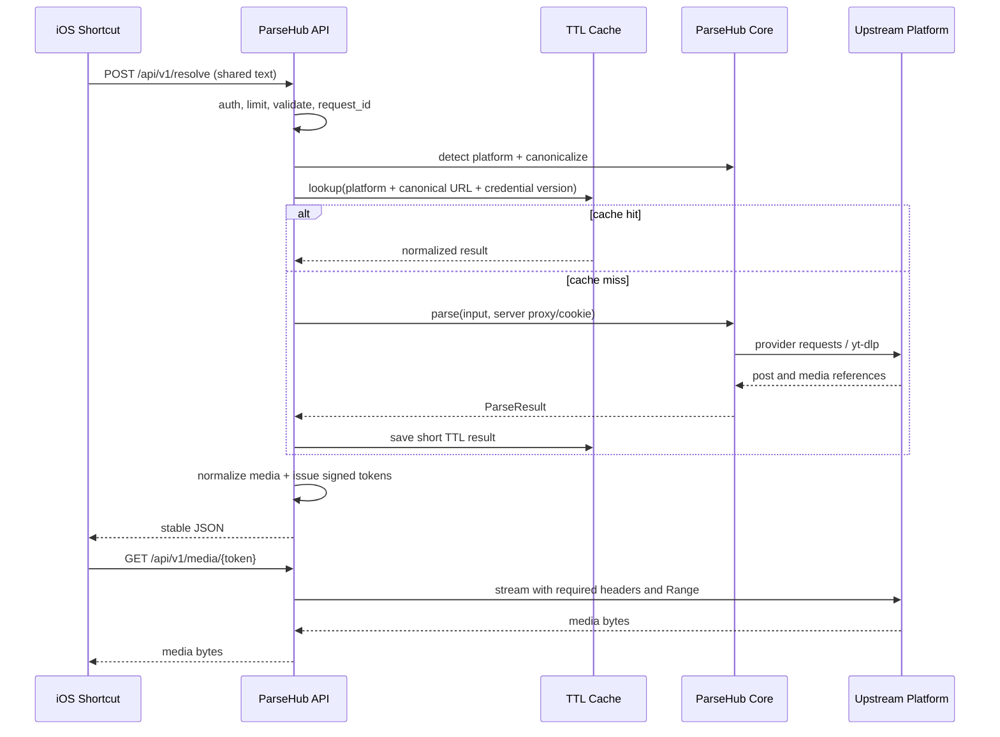

# ParseHub API 化架构方案

> 实施状态（2026-07-11）：M1–M4 的核心能力已经落地，包括签名媒体代理、Range/HEAD、异步打包任务、Redis 分布式缓存/限流/额度/Token、平台熔断、多用户 Key、Prometheus 指标和可选 S3 产物存储。多副本 Job worker 仍建议按 `OPERATIONS.md` 独立部署或配置会话粘滞。

## 1. 目标与边界

把现有 ParseHub 保留为“解析内核”，在其外部增加一个可独立部署的 HTTP API 服务，供 iOS 快捷指令通过“复制链接”或“分享表单”调用。

首版目标：

- 接收纯链接或包含链接的分享文案。
- 自动识别平台并返回统一 JSON。
- 既能返回上游媒体直链，也能由服务端中转媒体，解决部分平台的 Header、Cookie、时效和防盗链问题。
- Cookie、代理、签名参数只保存在服务端，不由快捷指令上传或持久化。
- 支持后续增加用户、额度、异步下载、对象存储，而不污染解析器代码。

首版不建议做：在线后台、用户自行提交 Cookie、永久媒体库、复杂转码、把每个平台拆成微服务。

## 2. 现有项目判断

当前代码本质是异步 Python 库加 CLI，而不是 Web 服务：

1. `ParseHub.parse()` 通过解析器注册表识别平台并返回 `ParseResult`。
2. `BaseParser.parse()` 完成分享文案取链、短链跳转、参数清理、平台实现调用和结果标准化。
3. `ParseResult.to_dict()` 已经提供接近 API 响应的统一结构：`platform/type/title/content/raw_url/media`。
4. 下载属于结果对象的方法，写入本地目录；进度回调只适用于进程内调用。
5. 平台实现分成 `parsers/parser`（适配层）和 `provider_api`（上游协议层），边界基本可复用。
6. YouTube、Facebook、Snapchat 等依赖 `yt-dlp` 子进程；部分站点需要 Cookie、代理或设备参数，因此 API 容器不是纯 HTTP 轻量函数。

因此不应该把 FastAPI 路由写进各个平台解析器。正确边界是：

```text
iOS Shortcut -> HTTP API -> Application Service -> ParseHub Core -> Platform Provider
                                  |                    |
                                  |                    +-> upstream sites / yt-dlp
                                  +-> cache / job / media gateway
```

## 3. 推荐的部署形态

### 3.1 第一阶段：模块化单体

一个镜像、一个 API 进程，Redis 可选：

- **FastAPI + Uvicorn**：HTTP、OpenAPI、校验、流式响应。
- **现有 ParseHub**：解析内核，尽量只做少量可测试的适配。
- **进程内 TTL Cache**：个人使用首版足够；多副本时换 Redis。
- **Media Gateway**：按需代理媒体，不默认落盘。
- **Worker（第二阶段）**：仅大文件下载、打包和转码进入异步任务。

不推荐一开始使用 Serverless：`yt-dlp`、较大的 OpenCV 依赖、长请求、临时文件和媒体流量容易碰到包体、超时、内存与响应大小限制。更适合 Docker VPS/NAS；API 与媒体出口最好在同一节点。

### 3.2 目录建议

```text
src/
  parsehub/                 # 原解析内核，继续可作为库发布
  parsehub_api/
    main.py                 # app factory / lifespan
    settings.py             # 环境变量配置
    dependencies.py         # auth、service、request context
    routers/
      health.py
      resolve.py
      platforms.py
      media.py
      jobs.py               # 第二阶段
    schemas/
      common.py
      resolve.py
      media.py
    services/
      resolver.py           # 调用 ParseHub，超时、缓存、错误映射
      media_gateway.py      # 安全流式代理、Range、Header 重建
      credential_store.py   # 按平台获取服务端 Cookie/代理
      token_store.py        # 短期 media token，避免把真实 URL 塞进路径
    middleware/
      request_id.py
      access_log.py
      rate_limit.py
    errors.py
tests/
  api/
Dockerfile
compose.yaml
.env.example
```

## 4. API 契约

统一前缀使用 `/api/v1`，避免将来快捷指令因接口升级全部重做。

### 4.1 解析

`POST /api/v1/resolve`

请求：

```json
{
  "input": "复制这段文案 https://example.com/post/1",
  "delivery": "auto",
  "include_content": true
}
```

- `input`：链接或分享文案，限制长度（如 8192 字符）。
- `delivery`：`direct | proxy | auto`。`auto` 由服务端按平台和媒体特征决定。
- 不接受客户端传入 `proxy` 或 `cookie`。

成功响应：

```json
{
  "ok": true,
  "request_id": "req_...",
  "data": {
    "platform": {"id": "xhs", "name": "小红书"},
    "post": {
      "type": "multimedia",
      "title": "标题",
      "content": "正文",
      "canonical_url": "https://..."
    },
    "media": [
      {
        "id": "m_1",
        "kind": "image",
        "url": "https://api.example.com/api/v1/media/eyJ...",
        "source_url": null,
        "thumbnail_url": "https://...",
        "extension": "jpg",
        "width": 1080,
        "height": 1440,
        "duration": 0,
        "expires_at": "2026-07-11T12:00:00Z"
      }
    ],
    "cache": {"hit": false, "ttl": 300}
  }
}
```

建议把现有 `media` 的“单对象或数组”统一成数组，快捷指令无需写两套分支；用 `kind` 显式区分 `image/video/animation/live_photo`。Live Photo 可增加 `paired_video_url`，而不是隐式复用普通媒体字段。

### 4.2 平台与健康检查

- `GET /api/v1/platforms`：基于 `get_platforms()` 返回支持平台及能力。
- `GET /health/live`：进程存活，不访问上游。
- `GET /health/ready`：注册表加载、可选 Redis/存储连通。

### 4.3 媒体获取

`GET|HEAD /api/v1/media/{signed_token}`

- Token 包含或映射到媒体 URL、平台、必要 Header、过期时间，必须签名且短期有效。
- 转发 `Range` 并透传 `Content-Type`、`Content-Length`、`Content-Range`、文件名，才能让 iOS 正常预览/保存大视频。
- 不允许该接口接收任意 `?url=`，否则会成为 SSRF/开放代理。
- 上游 URL 不写 access log；302 到直链只用于无需 Header/Cookie 的平台，否则由服务端流式中转。

### 4.4 统一错误

```json
{
  "ok": false,
  "request_id": "req_...",
  "error": {
    "code": "PLATFORM_UNSUPPORTED",
    "message": "暂不支持该链接",
    "retryable": false,
    "details": null
  }
}
```

推荐映射：

| 场景 | HTTP | code |
|---|---:|---|
| 输入为空/格式错误 | 422 | `INVALID_INPUT` |
| 不支持的平台 | 422 | `PLATFORM_UNSUPPORTED` |
| 需要登录态 | 409 | `CREDENTIAL_REQUIRED` |
| 上游风控/解析失败 | 502 | `UPSTREAM_PARSE_FAILED` |
| 上游超时 | 504 | `UPSTREAM_TIMEOUT` |
| 请求过频 | 429 | `RATE_LIMITED` |
| 服务端内部错误 | 500 | `INTERNAL_ERROR` |

响应绝不能包含 Cookie、代理地址、完整 Python 异常或上游响应正文。现有少数错误字符串会拼入 Cookie，API 边界必须先脱敏，后续再从内核中移除这种行为。

## 5. 关键请求流程



解析超时建议 25–45 秒，媒体流不使用同一超时。客户端断开时要取消上游请求和 `yt-dlp` 子进程。

## 6. iOS 快捷指令设计

快捷指令只承担输入和展示，不承担平台差异：

1. 接收分享表单输入；没有输入则读取剪贴板。
2. 若输入是列表，合并成文本；直接把原文发给 `POST /api/v1/resolve`。
3. Header：`Authorization: Bearer <个人 API Key>`、`Content-Type: application/json`。
4. 根据 `ok` 分支；失败显示 `error.message`。
5. `media` 为 1 个时直接“获取 URL 内容”并打开分享表单；多个时显示菜单：保存全部、逐个预览、复制原文。
6. 无媒体的富文本内容复制到剪贴板或生成 Markdown 文件。

API Key 会存在快捷指令中，个人自用可以接受；若公开分享快捷指令，应改用每用户可撤销 Key，设置额度并避免把主密钥硬编码在公开 `.shortcut` 文件。

## 7. 配置与凭据

环境变量建议：

```dotenv
PARSEHUB_API_KEYS=key1,key2
PARSEHUB_TOKEN_SECRET=change-me
PARSEHUB_PARSE_TIMEOUT=35
PARSEHUB_CACHE_TTL=300
PARSEHUB_MAX_INPUT_LENGTH=8192
PARSEHUB_MAX_CONCURRENT_PARSE=8
PARSEHUB_PROXY_DEFAULT=
PARSEHUB_PROXY_XHS=
PARSEHUB_COOKIE_XHS=
PARSEHUB_COOKIE_TWITTER=
PARSEHUB_DOUYIN_DEVICE_ID=
PARSEHUB_DOUYIN_IID=
```

Cookie 应支持 Docker Secret/文件挂载，日志只输出“是否配置”和凭据版本号。缓存键包含凭据版本，轮换 Cookie 后不会继续命中旧结果。

## 8. 并发、缓存与任务

- 每平台单独并发闸门，避免一个被风控的平台拖死全局。
- 解析结果只缓存数分钟；媒体地址经常有签名和过期时间，不适合长缓存。
- 相同规范化 URL 使用 single-flight，避免多人同时触发同一上游解析。
- 纯解析保持同步 HTTP；只有“服务端下载、压缩多图、转码、上传对象存储”才进入异步 Job。
- 第二阶段 Job API：`POST /jobs`、`GET /jobs/{id}`、`DELETE /jobs/{id}`，状态 `queued/running/succeeded/failed/expired`。
- 下载临时文件按任务隔离，设置总大小、单文件大小、文件数、执行时长和磁盘配额，完成或失败都清理。

## 9. 安全和运维底线

1. **SSRF**：只允许已注册解析器匹配的 URL；短链重定向每一跳都校验 scheme、hostname 和解析后的 IP，拒绝 loopback、私网、链路本地、保留地址及非 HTTP(S)。
2. **开放代理**：媒体网关只接受服务端签发的短期 Token，Token 绑定 URL 和策略。
3. **凭据泄漏**：不接受客户端 Cookie；异常、日志、追踪、缓存中均做脱敏。
4. **资源耗尽**：限制输入、重定向次数、解析并发、上游响应体、媒体大小、Range 数量和任务磁盘。
5. **子进程**：`yt-dlp` 继续使用参数数组而非 shell 字符串；设置 deadline，断开即终止。
6. **可观测性**：结构化记录 `request_id/platform/duration/cache_hit/error_code`，不记录原始分享文案、Cookie 和媒体查询参数。
7. **版本漂移**：平台解析易失效；平台级成功率、P95 和错误码统计比仅看服务存活更重要。

## 10. 对现有内核的最小改造

第一阶段避免重写平台解析器，只做以下边界改造：

1. 增加 API 包和 Pydantic API Schema，不直接把内部 dataclass 暴露为永久契约。
2. 给解析服务注入“按平台凭据/代理策略”，路由层不感知平台细节。
3. 增加结构化错误原因，替代根据中文错误字符串判断类别。
4. 移除任何把 Cookie 拼进异常消息的代码。
5. 为媒体引用补充可选 `headers`/交付策略（应内部使用，不直接返回客户端）。
6. 把重定向解析提取为可校验每一跳的安全组件。
7. 为 `yt-dlp` 子进程增加统一取消与 deadline。

保持 `parsehub` 和 `parsehub_api` 分包，可以继续独立发布库，也便于跟进上游 ParseHub 更新。

## 11. 实施里程碑

### M1：可用 MVP

- FastAPI app、`/resolve`、`/platforms`、健康检查。
- Bearer API Key、统一响应/错误、超时、请求 ID、基础限流。
- 内存 TTL 缓存。
- Dockerfile、Compose、`.env.example`。
- API 单元测试使用假解析器，不依赖外网。

### M2：快捷指令友好

- 媒体数组标准化、signed media token、HEAD/Range 流式代理。
- 用 3–5 个代表平台做真实回归：单视频、多图、Live Photo、富文本、需要 Cookie。
- 生成并实机验证快捷指令。

### M3：稳定运行

- Redis single-flight/限流/缓存，多副本部署。
- 平台级指标、凭据轮换、上游失败熔断。
- 异步下载/打包、临时文件配额与清理。

### M4：多用户（仅在确有需要时）

- 用户级 API Key、配额、审计、管理面。
- 对象存储与带过期时间的下载链接。

## 12. 验收标准

- 同一快捷指令可以处理纯 URL 和平台分享文案。
- 所有成功响应的 `media` 永远是数组，错误结构稳定。
- API 日志和错误响应中搜索不到配置的 Cookie/API Key。
- 未签名媒体 URL、过期 Token、内网目标、非支持域名均被拒绝。
- 视频 Range 请求能在 iOS 上预览、保存，并支持中断清理。
- 单个平台超时不会耗尽全部 worker；重复 URL 不会并发打上游。
- `ruff`、`mypy`、`pytest` 和 API 契约测试通过。
